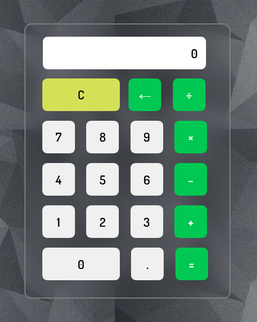

# 🔢 Stylish Calculator App

A modern, interactive calculator built using **HTML**, **CSS**, and **JavaScript** — complete with sound effects, a glassmorphic UI, and operator-safe input handling.

---

## ✨ Features

- ✅ Basic operations: +, −, ×, ÷
- ✅ Custom sound feedback on button press
- ✅ Styled using modern UI trends
- ✅ Smooth hover and click animations
- ✅ Clean and readable code with comments

---

## 🖼️ Preview



---

## 🚀 Getting Started

### 1. Clone the repository

```bash
git clone https://github.com/your-username/Calculator.git
cd Calculator
```

### 2. Run the app

Just open the `index.html` file in your browser:

```bash
Right-click -> Open with -> Your browser
```

---

## 📁 File Structure

```
calculator/
├── index.html         # Main HTML structure
├── style.css          # Custom styles 
├── script.js          # JavaScript logic and interactivity
├── assest/
│   ├── background3.jpg     # Background image
│   └── select-sound.mp3    # Button click sound
├── screenshot.png      # Screenshot preview
└── README.md
```

---

## 🛠️ Built With

- HTML5
- CSS3
- JavaScript

---

## 📌 Future Improvements

- [ ] Add keyboard support
- [ ] Make fully responsive for mobile screens
- [ ] Add percentage support
- [ ] Add history log
- [ ] Toggle dark/light themes

---

## 🧪 Testing

Tested on:
- Chrome
- Edge
- Firefox

All UI buttons and operations work as expected. Sound plays on each press. Errors like repeated operators are prevented.

---

## 👨‍💻 Author

Made with ❤️ by **Parth Verma**

---

## 📄 License

This project is licensed under the [MIT License](LICENSE).
